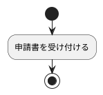

# Markdown Library

庁内で再利用できる Markdown 形式のナレッジを共有するための静的サイトです。
生成AIのプロンプト、PlantUML・Mermaid のコード、Markdown テンプレート、定型文、
手順・ノウハウ、各種コードやスニペットなどを、登録・検索・閲覧・コピーできます。

このファイルは、サイトを**管理・更新する職員向け**の説明です。

---

## 概要

- 原本は `entries/` 配下の Markdown ファイルです（**1ファイル＝1エントリ**）。
- 各ファイルは「front matter（タイトル・カテゴリ・タグ・説明）＋ Markdown 本文」で構成します。
  本文の書き方に決まった型はありません。
- 追加するときは、Markdown ファイルを置き、`data/manifest.json` にファイル名を1行登録します。
  （静的配信ではフォルダ内のファイルを自動列挙できないため、この2か所の更新が必要です。）
- 修正するときは、Markdown ファイルを直すだけで完了します。
- 検索・絞り込み・表示・コピーはすべてブラウザ内で動作します。
- データベース、サーバサイド処理、外部API、CDN、ビルド工程はいずれも使用していません。

### このサイトで行わないこと

- PlantUML・Mermaid などを図に変換・描画することはしません。コードとして表示し、コピーできるだけです。
  図への変換は、それぞれに対応した別のツールで行ってください。
- サーバへの直接登録、承認・審査、履歴管理、ユーザー認証は行いません。
  登録・更新は、管理担当者がファイルを配置して行います。

### ファイル構成

```text
/
├─ index.html          画面（一覧・検索・詳細表示）
├─ editor.html         Markdown エディタ（作成・編集支援。下記参照）
├─ web.config          IIS 用の MIME 設定
├─ .nojekyll           GitHub Pages で Jekyll 処理を無効にするための空ファイル
├─ entries/            エントリ本体（Markdown）
│  └─ meeting-minutes.md、業務フロー図のひな形.md など
├─ data/
│  ├─ manifest.json    読み込む Markdown の一覧
│  └─ tags.json        カテゴリとタグの定義
├─ css/
│  ├─ style.css        画面共通スタイル
│  └─ editor.css       エディタ専用スタイル
└─ js/
   ├─ entry-parser.js  エントリの解析・生成（EntryParser。app.js・editor.js 共通）
   ├─ markdown.js      本文の Markdown 表示（MiniMarkdown。app.js・editor.js 共通）
   ├─ clipboard.js     クリップボードへのコピー（CopyHelper。app.js・editor.js 共通）
   ├─ app.js           一覧・検索・詳細表示
   └─ editor.js        Markdown エディタの動作
```

---

## 動作方法

### 動作環境

Microsoft Edge、Google Chrome、Firefox の現行版で動作します。
Internet Explorer には対応していません。

**Web サーバ経由で開く必要があります。**
`index.html` をダブルクリックして開くと、ブラウザの制限により Markdown を読み込めません。

動作確認だけなら、フォルダ内で簡易サーバを起動するのが手軽です。

```powershell
# Python が入っている場合
python -m http.server 8000
# → ブラウザで http://localhost:8000/ を開く
```

---

## IIS への配置方法

1. このフォルダ一式を、IIS の公開ディレクトリへコピーします。
   （例：`C:\inetpub\wwwroot\markdown-library\`）
2. IIS マネージャーで、そのフォルダを**アプリケーション**または**仮想ディレクトリ**として設定します。
3. ブラウザで `http://<サーバ名>/markdown-library/` を開きます。

### 注意点

- **`web.config` を必ず一緒に配置してください。** IIS は既定で `.md` を配信せず、
  無いと Markdown が 404 になります。`web.config` が使えない環境では、
  IIS マネージャーの「MIME の種類」で `.md` → `text/markdown` を手動追加してください。
- サブディレクトリ配置に対応しています。パスはすべて相対で解決するため、
  `/` 直下でも `/tools/markdown-library/` でも設定変更なしで動作します。
- 日本語のファイル名もそのまま配信できます。読み込み時にファイル名を URL エンコードして取得します。
- 更新が反映されない場合はブラウザのキャッシュを削除してください
  （Markdown と JSON は `no-cache` で取得しますが、`css`・`js` はキャッシュされます）。

## GitHub Pages での公開

リポジトリの設定で GitHub Pages を有効にすれば、そのまま公開できます（ビルド不要）。
`.nojekyll` は Jekyll による変換を止め、`.md` を元のまま配信させるためのファイルです。削除しないでください。

---

## エントリの追加方法

Markdown を手書きする方法（下記）のほか、`editor.html`（Markdown エディタ）を使うと、
フォーム入力から仕様に合った Markdown を生成できます。生成した Markdown は
ダウンロードするだけで、GitHub や公開サーバへの反映は行いません。
ダウンロード後は、下記の手順と同様に `entries/` へ配置し `data/manifest.json` に登録してください。

### 1. Markdown ファイルを作る

`entries/` に新しいファイルを作成します（文字コードは UTF-8）。
ファイル名は**日本語も使えます**（例：`会議メモから議事録を作成.md`）。
ファイル名から拡張子を除いたものが、そのまま詳細画面の URL の識別子になります。

Windows・IIS で安全に扱えるよう、次のファイル名は使えません
（Markdown エディタでは入力時に自動で検査します）。

- 末尾が半角の `.md` でないもの
- `\ / : * ? " < > |` や制御文字を含むもの
- 先頭・末尾が空白のもの、末尾（`.md` の直前）がピリオドや空白のもの
- `.` `..` だけのもの
- Windows の予約名（`CON` `PRN` `AUX` `NUL` `COM1`〜`COM9` `LPT1`〜`LPT9`。`CON.txt.md` なども不可）
- 150文字を超えるもの

`#` や `%` を含む名前も動作しますが、URL を共有するときに分かりにくくなるため、避けるのが無難です。

### 2. `data/manifest.json` に登録する

静的サイトではフォルダ内のファイルを自動で一覧できないため、
追加したファイル名を `entries` 配列に書き足します。**この登録を忘れると画面に出ません。**

```json
{
  "entries": [
    "meeting-minutes.md",
    "会議メモから議事録を作成.md"
  ]
}
```

- 記載した順にカードが並びます。
- 末尾の要素にカンマを付けないでください（JSON の構文エラーになります）。
- 削除するときは、Markdown ファイルとこの行の両方を消します。
- 登録したのにファイルが無い（名前の打ち間違いを含む）場合、そのファイルだけ読み飛ばし、
  一覧の上部に読み込めなかったファイル名を表示します。

### 3. ブラウザで表示を確認する

一覧に出ること、詳細が開くこと、「Markdownをコピー」やコードブロックの「コピー」で
意図した内容がコピーされることを確認します。

---

## Markdown ファイルの書き方

### front matter

Markdown の先頭に `---` で挟んだ領域を置き、次の4項目を記載します。

```yaml
---
title: 会議メモから議事録を作成
category: 文書作成
tags:
  - プロンプト
  - 会議
  - 議事録
description: 箇条書きの会議メモを、共有可能な議事録形式に整理します。
---
```

| 項目 | 必須 | 内容 |
| --- | --- | --- |
| `title` | ○ | 一覧・詳細に出る名前。30字程度まで |
| `category` | ○ | 大分類。1つだけ。`data/tags.json` の定義済みカテゴリから選ぶ |
| `tags` | － | 0〜5個程度。1行1個、行頭は半角スペース2つ＋`- ` |
| `description` | ○ | 一覧カードに出る1行説明。40字程度まで |

記述上の注意：

- `---` は**行頭**に置き、前に空行やスペースを入れないでください。
- `:` の後には**半角スペース**を1つ入れてください。
- 値に `:` や `#` を含めたい場合は `title: "対応方針：検討用"` のように引用符で囲みます。
- タグを書かない場合は `tags:` の行ごと省略してください。
- プロンプト・PlantUML などの「形式」の違いは、専用の項目ではなくタグで表します。

### 本文

front matter の後ろは、**すべてがそのエントリの本文**です。見出しの名前や順序に決まりはありません。
詳細画面では、タイトル・説明・タグは front matter から表示するため、
本文の先頭にタイトルと同じ見出しを書く必要はありません。

画面で表示できる書式は次のとおりです。

| 書式 | 書き方 |
| --- | --- |
| 見出し | `#` 〜 `######` ＋ 半角スペース |
| 段落・改行 | 空行で段落を分けます。段落内の改行はそのまま改行として表示します |
| 箇条書き | `- ` `* ` `+ `（字下げで入れ子にできます） |
| 番号付きリスト | `1. ` または `1) ` |
| 太字 | `**強調**` |
| インラインコード | `` `コード` `` |
| コードブロック | ` ``` ` または `~~~` で囲みます。開始行に言語名（`text` `plantuml` `mermaid` など）を書けます |
| 区切り線 | `---` |

- 表・リンク・画像などには対応していません。書いた文字がそのまま表示されます。
- 本文中の HTML タグは実行されず、文字としてそのまま表示されます。
- コードブロックの中身は変換せずにそのまま表示します。PlantUML・Mermaid も図にはなりません。

### コピーの仕組み

詳細画面には2種類のコピー操作があります。

- **「Markdownをコピー」**：front matter を除いた本文全体をコピーします。
  Markdown テンプレートなどを丸ごと再利用するときに使います。
- **コードブロックの「コピー」**：各コードブロックの右上に表示されます。
  そのブロックのコード本文だけ（` ``` ` や言語名は含まない）をコピーします。

生成AIのプロンプトや PlantUML のコードのように「そこだけ使う」文面は、
コードブロックに入れておくと、利用者がワンクリックでその部分だけをコピーできます。

### 本文の例（生成AIプロンプト）

````markdown
## 使い方

会議中に取ったメモを、プロンプト末尾に貼り付けて使用します。

## プロンプト

```text
あなたは行政文書の作成補助者です。

以下の会議メモを……

【会議メモ】
（ここに会議メモを貼り付けてください）
```
````

### 本文の例（PlantUML）

````markdown
## 使い方

下のコードをコピーし、PlantUML に対応したツールへ貼り付けて図にします。


````

- 貼り付け位置は `（ここに会議メモを貼り付けてください）` のように明示すると親切です。
- **実在の個人情報・機密情報は書かないでください。**

---

## Markdown エディタ（editor.html）

front matter を手書きせずに、エントリを作成・編集するための支援画面です。
一覧画面右上の「＋ Markdownを追加」、または詳細画面の「このMarkdownを編集」から開きます。

入力項目：

| 項目 | 内容 |
| --- | --- |
| タイトル・説明 | front matter の `title`・`description` になります |
| カテゴリ・タグ | `data/tags.json` の定義から選択します（自由入力はできません） |
| Markdown本文 | 入力した内容が、そのまま front matter の後ろに保存されます。見出しなどを自動で書き足すことはありません |
| 保存ファイル名 | 日本語も使えます。上記「1. Markdown ファイルを作る」の規則で入力時に検査します |

- 右側のプレビューは、一覧の詳細画面と同じ表示方法（`js/markdown.js`）で本文を表示します。
  プレビュー内のコードブロックの「コピー」も動作します。
- 「生成される Markdown」に、保存される Markdown 全文（front matter ＋ 本文）を表示します。
- 必須項目（タイトル・カテゴリ・説明・本文・保存ファイル名）がそろうと、
  「.md ファイルをダウンロード」でダウンロードできます。あわせて `manifest.json` に追加する行を表示します。
- 詳細画面の「このMarkdownを編集」から開くと、`editor.html?file=<ファイル名>` の形式で
  `entries/` 内の既存ファイルを読み込みます。読み込めるのは `entries/` 直下の `.md` だけです。
- 「ローカルの .md ファイルを直接開く」から、手元のファイルを読み込むこともできます。
- 読み込んだファイルは front matter と本文に分け、本文は手を加えずに「Markdown本文」欄へ展開します。
- 読み込んだファイルに `data/tags.json` 未定義のカテゴリ・タグがある場合は、
  値を消さずに保持したうえで警告を表示します（正式な追加は管理側で `tags.json` を更新します）。

---

## カテゴリ・タグの追加・変更方法

定義は `data/tags.json` にまとめています。カテゴリ・タグの追加・変更は管理側の作業です
（Markdown エディタからは追加できません）。

```json
{
  "categories": ["文書作成", "文章改善", "企画・検討", "調査・整理", "業務改善", "データ・IT"],
  "tags": ["プロンプト", "PlantUML", "要約", "校正", "会議", "議事録", "分析", "住民向け", "庁内向け"]
}
```

- **カテゴリ**は「どの業務領域に置くか」を表す大分類です。1エントリにつき1つ。
  部署名では分類しません。増やしすぎると選びにくくなるため、追加は慎重に判断してください。
- **タグ**は「用途・形式・対象」を横断的に表すものです（例：`要約`、`プロンプト`・`PlantUML`、`住民向け`）。
  表記揺れを防ぐため、原則としてこの一覧にあるものから選んでください。
  `Mermaid`・`テンプレート` などの形式タグも、該当するエントリを登録するときに追加してください。
- 記載した順に画面へ並びます。
- 一覧に無いタグを Markdown 側で使っても表示は壊れませんが、絞り込みの末尾に追加表示されます。
  継続して使うタグは、この `tags.json` にも追加してください。
- 使われていないタグは絞り込みに表示されません（定義だけ残しておいても問題ありません）。

### カテゴリ名を変更するとき

`data/tags.json` と、該当する Markdown すべての `category:` の両方を書き換えてください。
片方だけ直すと、未定義のカテゴリとして絞り込みの末尾に表示されます。

---

## 画面でできること

- キーワード検索（タイトル・説明・カテゴリ・タグ・本文が対象。空白区切りで AND 検索）
- カテゴリによる絞り込み（1つ選択）
- タグによる絞り込み（複数選択。選ぶほど件数が絞られます）
- 絞り込み条件の表示と個別解除・一括解除
- 詳細画面での本文表示、「Markdownをコピー」、コードブロックごとの「コピー」
- 詳細画面から Markdown エディタでの編集
- キーボード操作：`/` で検索欄へ、`Esc` で一覧に戻る／絞り込み解除

詳細画面の URL は `index.html#<ファイル名から .md を除いたもの>` の形式です
（例：`index.html#meeting-minutes`）。特定のエントリを案内するときは、この URL をそのまま共有できます。

クリップボードへのコピーは、`https://` では Clipboard API、庁内 IIS の `http://` 配信など
Clipboard API が使えない環境では従来方式に切り替えて動作します。
