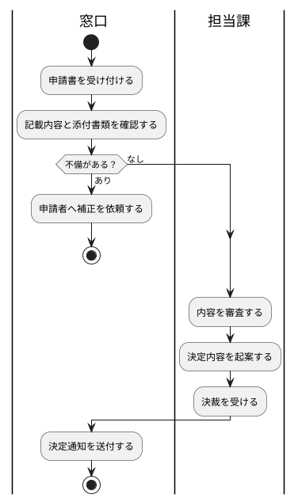

## 使い方

下のコードをコピーし、PlantUML に対応したツールへ貼り付けて図にします。
このライブラリでは図への変換は行わず、コードの共有だけを行います。

- `|窓口|` などのレーン名と、各工程の文言を実際の業務に合わせて書き換えてください。
- 分岐が不要な場合は、`if` から `endif` までを削除してください。

## コード

```plantuml
@startuml
|窓口|
start
:申請書を受け付ける;
:記載内容と添付書類を確認する;
if (不備がある？) then (あり)
  :申請者へ補正を依頼する;
  stop
else (なし)
endif
|担当課|
:内容を審査する;
:決定内容を起案する;
:決裁を受ける;
|窓口|
:決定通知を送付する;
stop
@enduml
```
